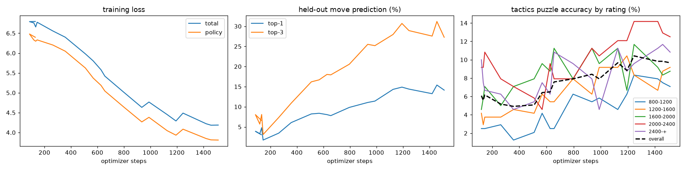

# blundernet ♟️

A small AlphaZero-style chess network that **trains itself continuously** on fresh games
from top Lichess blitz players — no human in the loop.



## How it works

On a schedule, a GitHub Actions run:

1. **Ingests** fresh rated blitz/rapid games from a rotating pool of strong Lichess
   players (via the public Lichess API, cursored so no game is ever seen twice)
2. **Trains** a 6-block residual policy+value network (~450k params, PyTorch, CPU)
   incrementally on the new positions
3. **Evaluates** two ways and appends to [`metrics/history.csv`](metrics/history.csv):
   - top-1 / top-3 move-prediction accuracy on a held-out slice it never trained on
   - **tactics-puzzle accuracy** on a fixed 1,200-puzzle Lichess suite, bucketed by
     difficulty (800–1200 … 2400+), so you can watch it solve progressively harder
     tactics as it learns
4. **Publishes** the updated checkpoint as a rolling GitHub release and commits the
   metrics, so the training curve in this README is always live

The model: 18-plane board encoding → 6 residual blocks (64ch) → policy head over
4096 from×to move indices + tanh value head, trained with cross-entropy + MSE
(AlphaZero's supervised objective).

## Current state

See [`metrics/latest.json`](metrics/latest.json) for the newest eval numbers.

## Run locally

```bash
python -m venv .venv && source .venv/bin/activate
pip install -r requirements.txt --extra-index-url https://download.pytorch.org/whl/cpu
python scripts/pipeline.py --no-commit
```

## Roadmap

- [x] Lichess tactics-puzzle evaluation suite (accuracy vs puzzle rating buckets)
- [ ] MCTS self-play wrapper so the net can actually play games
- [ ] Estimate playing strength vs Stockfish skill levels
- [ ] Elo-bucketed training: does the net mimic 1500s or 2800s?
